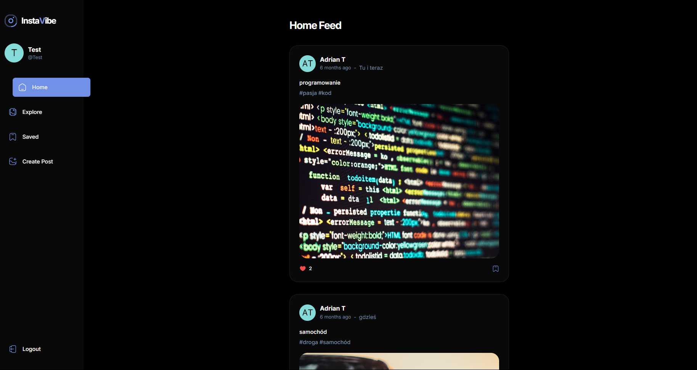
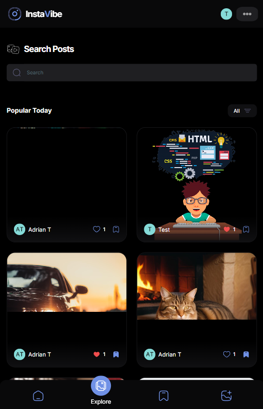
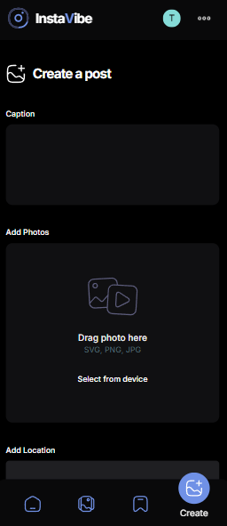

# InstaVibe

## Opis

InstaVibe to aplikacja do zarządzania postami w stylu Instagram, która pozwala użytkownikom na dodawanie zdjęć, opisów i hashtagów. Użytkownicy mogą przeglądać, polubić, edytować i usuwać swoje posty, co umożliwia łatwe zarządzanie treściami oraz interakcję z innymi użytkownikami. Aplikacja oferuje intuicyjny interfejs i responsywny design, zapewniając płynne doświadczenie na różnych urządzeniach.





## Technologie

- **React**: Biblioteka do budowy interfejsu użytkownika.
- **TypeScript**: Dodaje typowanie do JavaScriptu.
- **Tailwind CSS**: Framework CSS do stylizacji aplikacji.
- **Appwrite**: Backend do przechowywania danych i autoryzacji użytkowników.
  - **Database**: Przechowuje dane o postach i użytkownikach.
  - **Authentication**: Logowanie i rejestracja użytkowników.
- **React Router**: Nawigacja między widokami.
- **ESLint & Prettier**: Linting i formatowanie kodu.

## Instalacja

1. **Klonowanie repozytorium:**

   ```bash
   git clone https://github.com/DominikBernatowicz/InstaVibe.git
   cd InstaVibe
   ```

2. **Instalacja zależności**

   ```bash
   npm install
   ```

3. Konfiguracja Appwrite:

Upewnij się, że masz skonfigurowany lokalny serwer Appwrite oraz odpowiednie kolekcje w bazie danych. Dodaj szczegóły dotyczące konfiguracji w pliku .env.

4. **Uruchomienie lokalne:**
   
   ```bash
   npm run dev
   ```

## Rozwój
Planuję dodać następujące funkcjonalności do aplikacji:

  - **Lista znajomych:** Umożliwienie użytkownikom śledzenia znajomych oraz wyświetlanie postów znajomych na stronie głównej.
  - **Strona profilowa:** Tworzenie indywidualnych profili użytkowników, gdzie będą mogli przeglądać swoje posty oraz edytować informacje.
  - **Hosting:** Wdrożenie aplikacji na serwerze, aby była dostępna publicznie.
  - **Komentarze:** Umożliwienie użytkownikom komentowania postów, co zwiększy interakcję w aplikacji.
